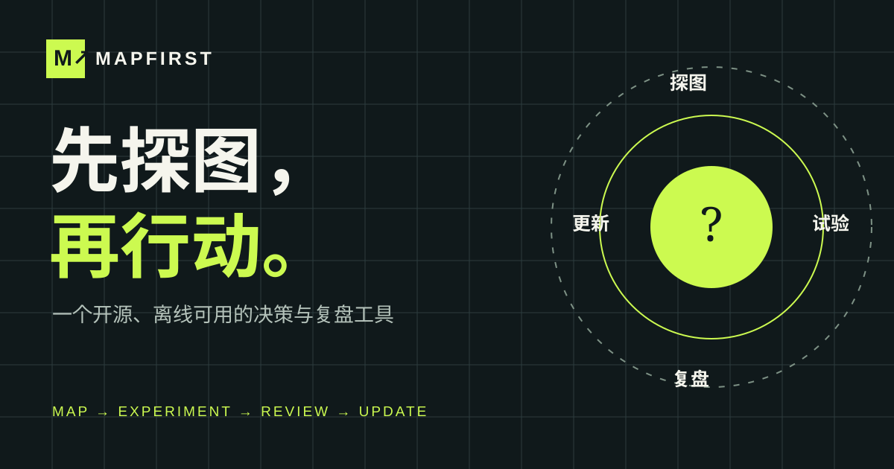

# MapFirst · 先探图，再行动



[English](README_EN.md) · 中文

> 一个开源、离线可用的决策与复盘工具：**探图 → 小步试验 → 复盘 → 更新**。

当你面对择业、学习、创作、创业等不确定选择时，MapFirst 帮你把“提升认知”落到一张可执行的画布上。它不会替你给出答案，而是帮你看见选项、发现信息缺口、设计低成本实验，并记录判断如何改变。

**[方法手册](docs/method.md)** · **[贡献指南](CONTRIBUTING.md)** · **[原视频](https://youtu.be/0Z-vhBvBmUY)**

**一句话介绍：** A local-first decision canvas that turns vague thinking into testable actions.

## 30 秒开始

1. 打开 `index.html`，或把仓库部署到 GitHub Pages。
2. 写下一个具体的、有时间边界的决定。
3. 填写选项、信息缺口、关键假设和七天实验。
4. 行动后补上事实和下一轮调整。

所有填写内容只保存在浏览器 `localStorage`。可以导出 JSON 备份或迁移；项目没有账户、追踪脚本和后端。

## 为什么做这个项目

“认知”很容易变成收藏观点，却没有改变行动。MapFirst 把它定义为一个可观察的循环：

| 阶段 | 要回答的问题 | 产出 |
| --- | --- | --- |
| 探图 | 有哪些选项？哪些事实还不知道？ | 选项与信息缺口 |
| 小步试验 | 哪个假设最关键？如何低成本验证？ | 七天行动 |
| 复盘 | 预期和事实有什么差异？ | 证据记录 |
| 更新 | 应继续、转向还是停止？ | 下一轮选择 |

AI 在其中是**研究助手**：帮助列选项、找反例、制定验证计划。工具内置可复制的提问模板，并要求 AI 标明推测，避免把生成内容当成事实。

## 功能

- 🗺️ 六格决策画布，记录从探图到更新的一整轮思考
- ✳️ 七天小实验，迫使大问题落到近期行动
- 🤖 一键生成 AI 研究提问模板
- 💾 浏览器本地自动保存、JSON 导入与导出
- 🌱 零依赖静态页面，可直接托管在 GitHub Pages
- ♿ 响应式布局、键盘焦点样式和表单标签

## 部署到 GitHub Pages

1. 新建公开仓库，例如 `mapfirst`，上传本项目全部文件。
2. 进入仓库 **Settings → Pages**。
3. 在 **Build and deployment** 中选择 **Deploy from a branch**，分支选 `main`，目录选 `/ (root)`。
4. 等待部署完成，访问 `https://<用户名>.github.io/mapfirst/`。

页面可直接运行，不需要 Node.js、构建步骤或密钥。若仓库名称不同，URL 中也使用对应名称。

## 项目结构

```text
mapfirst/
├── index.html          # 页面内容
├── style.css           # 页面样式
├── app.js              # 本地画布、提示词、导入导出
├── docs/method.md      # 方法手册与完整示例
├── CONTRIBUTING.md     # 参与贡献
└── LICENSE             # MIT 许可证
```

## 来源与边界

这个项目受[邵艾伦与孙宇晨的访谈](https://youtu.be/0Z-vhBvBmUY)启发，尤其是“先探图”、用 AI 扩大信息范围、把学习转为行动、持续更新判断等讨论。MapFirst 是独立整理和实现，**并非访谈嘉宾参与或认可的官方项目**。项目不复刻视频字幕或逐字稿。

对于医疗、法律、投资等高风险决定，画布只能辅助整理问题和证据，不能代替专业判断。用户应独立核实事实与来源。

## 路线图

- [ ] 多画布管理与搜索
- [ ] Markdown 导出
- [ ] 可打印的一页纸版本
- [ ] 英文界面
- [ ] 由社区提交的真实案例库

欢迎在 Issue 中提出场景或改进建议。提交 PR 前请阅读 [CONTRIBUTING.md](CONTRIBUTING.md)。

## License

[MIT](LICENSE) © 2026 MapFirst contributors
